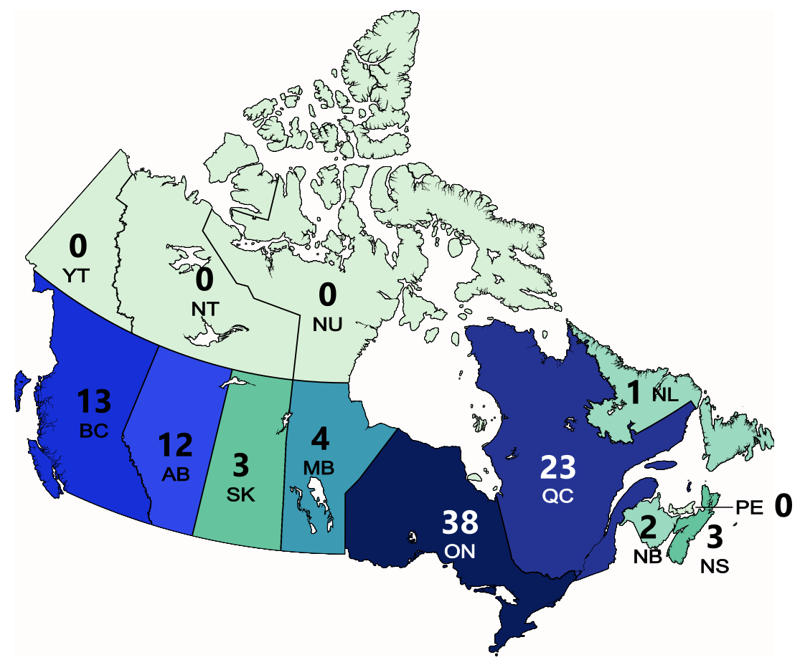
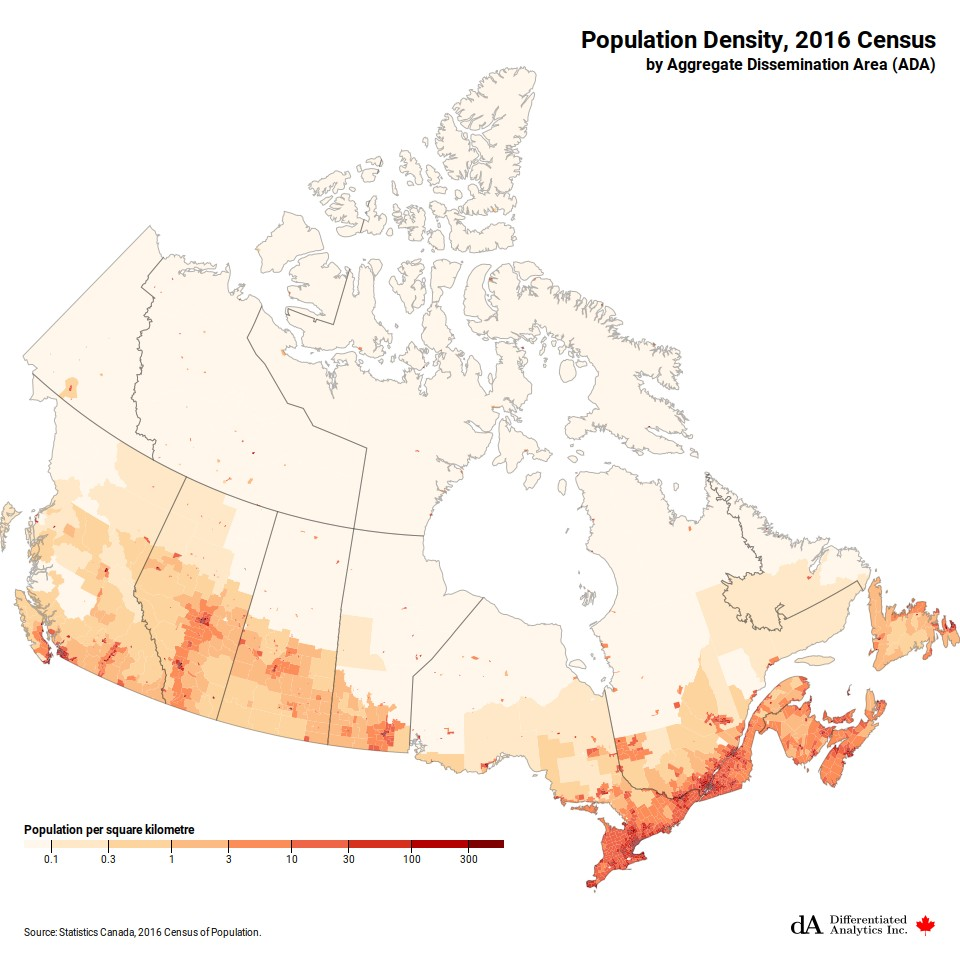
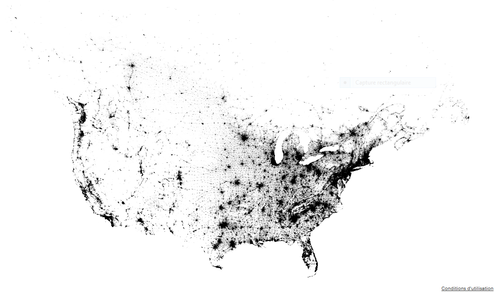
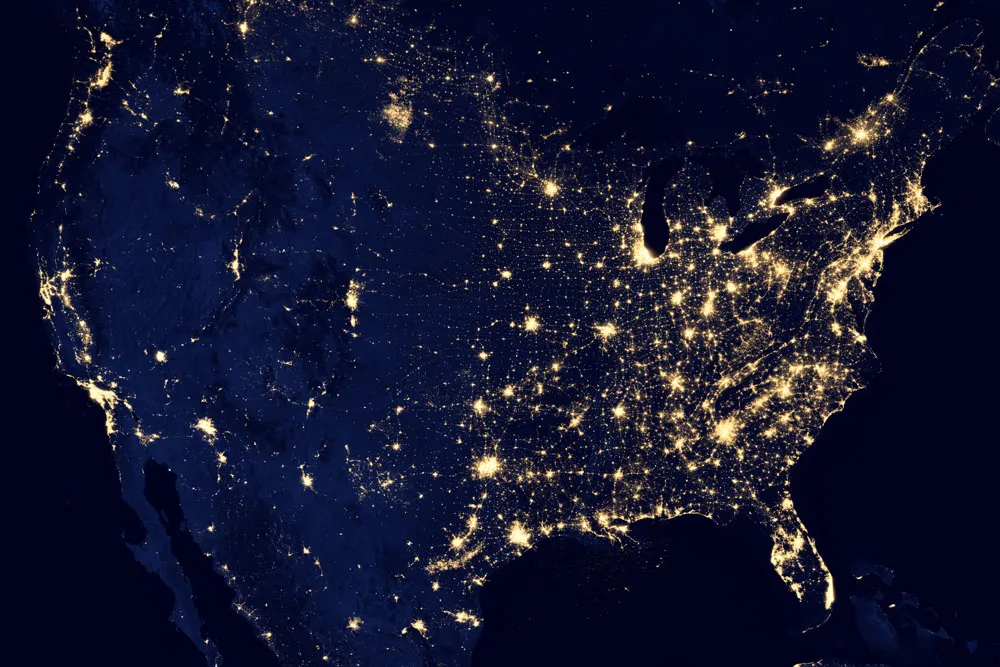

```{r setup, include=FALSE}
knitr::opts_chunk$set(echo = TRUE)
library(tidyverse)
# library(ggheatmap)
```

## Plan

* When is a map not appropriate for geospatial data?

* Tile geometry

* Heatmaps with dendrograms

* Specialized heatmap for the USA

## Population maps


::: footer
https://www.everviz.com/chart-examples/choropleth-categories-point-and-pattern-fill-maps/us-state-population-choropleth-map/
:::


## Population maps II


::: footer
https://www.census.gov/library/visualizations/2010/geo/population-density-county-2010.html
:::


---



---




## Population maps III



::: footer
https://flowingdata.com/2012/12/31/map-of-every-person-counted-in-2010-us-census/
:::

## Nighttime image of Earth



## Why shouldn't I use a map?

* Always think about the purpose

* Is geography the most important feature?

* Are you showing points or areas?

* Is your map approximately a population map?

* Will the area of a region complicate interpretation?

* Is the spatial extent one dimensional? What could you do with the other dimension?


## COVID-19 cases & geom_tile

```{r covid-data, message=FALSE, echo=FALSE, fig.align="center", out.width="100%", fig.asp = 0.65}
covid <- cansim::get_cansim("13-10-0775-01")
# covid2 <- get_cansim("13-10-0774-01")  # related data with extra information
covid_ss <- covid %>% filter(GEO != "Canada", Gender == "Total, all genders", 
                             `Age group` != "Total, all age groups") %>%
  filter(Statistics == "Community exposures") %>%
  mutate(GEO = str_remove(GEO, " Region"))
covid_ss %>%
  ggplot(aes(y = GEO, x = `Age group`, fill = VALUE)) + 
  geom_tile() +
  theme(axis.text.x = element_text(angle = 90, size=15, hjust = 1, vjust=0.5),
        axis.text.y = element_text(size=14, hjust = 1)) + 
  labs(x = "", y="")
```

## Grouping rows

```{r echo=FALSE}
#| fig-width: 5
#| fig-height: 4
#| out-width: "70%"
#| fig-align: "center"
library(tidyheatmaps)
covid_ss3 <- covid_ss |> filter(`Age group` != "Not stated, age group") |>
  mutate(GEO = fct_recode(GEO, "BC + Yukon" = "British Columbia and Yukon Region",
              "Prairies + NWT" = "Prairies and Northwest Territories Region",
              "ON + NU" = "Ontario and Nunavut Region",
             "QC"  =  "Quebec Region", 
             "Atlantic" = "Atlantic Region"))
covid_ss3 |>
  tidyheatmap(rows = `Age group`, columns = `GEO`, values = VALUE,
              cluster_rows = TRUE, cluster_cols = TRUE)
```

## Scaling

```{r}
#| fig-width: 5
#| fig-height: 4
#| out-width: "70%"
#| fig-align: "center"
covid_ss3 |>
  tidyheatmap(rows = `Age group`, columns = `GEO`, values = VALUE,
              cluster_rows = TRUE, cluster_cols = TRUE, 
              scale = "column")
```

## Specialized maps of USA

```{r}
library(statebins)
load("static/L29/election.rda")
m4 <- election %>% ggplot(aes(state = state, fill = pct_trump)) +
  geom_statebins() +
  theme_statebins() +
  labs(fill="Percent Trump")
```

## Specialized maps of USA

```{r fig.align=TRUE, out.width="90%", echo=FALSE, fig.asp=0.75}
m4
```

## Global version

See assignment 5

```{r echo = FALSE}
geodata <- read_csv("static/L29/geodata.csv", show_col_types = FALSE)
worldmap <- ggplot(geodata) +
  geom_rect(aes(xmin = x, ymin = y, 
                xmax = x + 1, ymax = y + 1,
                fill = region)) +
  geom_text(aes(x = x, y = y, 
                label = alpha.3),
            size = 1.5, 
            nudge_x = 0.5, nudge_y = -0.5,
            vjust = 0.5, hjust = 0.5) +
  scale_y_reverse() 
worldmap + theme_void()
```


## Summary

* Maps are very effective for showing points where spatial location is the primary information

* To show quantitative data varying along a transcect, a line or dot plot may be better

* Colour shows larger/smaller, positive/negative, but does not show quantitative values well

* Heatmaps (2 dimensional tiles of colours) can be a good alternative


## Further reading

* Course notes

* Healy Chapter 7


